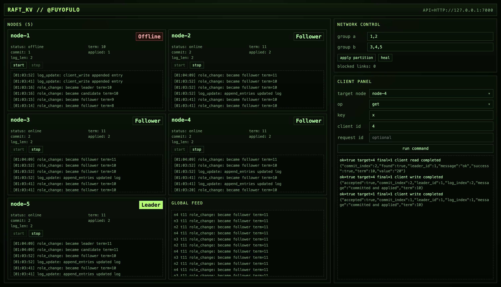

# raft-kv

An implementation of the Raft consensus algorithm built from scratch in Rust, with a replicated key-value state machine.



This project runs multiple Raft nodes over gRPC and includes both:

- a CLI workflow for direct command/testing
- a retro UI dashboard for visual cluster control and live Raft events

## Stack

- Rust
- Tokio (async runtime)
- Tonic + Prost (gRPC + protobuf)
- Serde + serde_json (durable on-disk state)

## Implemented capabilities

- Automated Raft leader election
- Heartbeat-based leader maintenance
- Log replication to followers
- Commit and apply flow
- Durable node state on disk (log + term/vote + applied state)
- Client operations: `put`, `update`, `delete`, `get`
- Follower-to-leader redirect behavior in the client
- Request dedup/caching using `client_id` + `request_id` metadata stored in replicated log entries
- Write response contract: success means committed and applied (or duplicate served from cache)
- Control plane with:
  - live Raft event collection
  - node start/stop controls
  - network partition/heal controls
  - client-command HTTP endpoint
- UI dashboard for:
  - viewing all 5 nodes at once
  - live node/global event feeds
  - node lifecycle controls
  - partition/heal actions
  - client command execution

## Project layout

- `src/bin/node.rs`: Raft node process (run one per node)
- `src/bin/client.rs`: CLI client for `put/update/delete/get`
- `src/raft/state.rs`: Core Raft state machine and protocol logic
- `src/raft/storage.rs`: Durable state load/save helpers
- `src/raft/events.rs`: Raft event model + node-local event emitter
- `src/rpc/server.rs`: gRPC service implementation
- `src/rpc/convert.rs`: Core <-> protobuf conversion helpers
- `src/proto/raft.proto`: protobuf API definition
- `src/bin/control_plane.rs`: HTTP control plane + event stream
- `ui/`: Vite + React terminal dashboard

## Run with UI

From project root:

```bash
cargo build
```

Start control plane:

```bash
cargo run --bin control_plane -- 127.0.0.1:7000
```

Start 5 nodes (use separate terminals):

```bash
cargo run --bin node -- 1 127.0.0.1:50051 2,3,4,5 data/node-1.json http://127.0.0.1:7000
cargo run --bin node -- 2 127.0.0.1:50052 1,3,4,5 data/node-2.json http://127.0.0.1:7000
cargo run --bin node -- 3 127.0.0.1:50053 1,2,4,5 data/node-3.json http://127.0.0.1:7000
cargo run --bin node -- 4 127.0.0.1:50054 1,2,3,5 data/node-4.json http://127.0.0.1:7000
cargo run --bin node -- 5 127.0.0.1:50055 1,2,3,4 data/node-5.json http://127.0.0.1:7000
```

Start UI:

```bash
cd ui
npm install
npm run dev
```

Default UI URL: `http://127.0.0.1:5173`  
Default control-plane URL used by UI: `http://127.0.0.1:7000`


## Run with CLI

Start nodes without UI (use separate terminals):

```bash
cargo run --bin node -- 1 127.0.0.1:50051 2,3,4,5
cargo run --bin node -- 2 127.0.0.1:50052 1,3,4,5
cargo run --bin node -- 3 127.0.0.1:50053 1,2,4,5
cargo run --bin node -- 4 127.0.0.1:50054 1,2,3,5
cargo run --bin node -- 5 127.0.0.1:50055 1,2,3,4
```

Run client commands:

```bash
cargo run --bin client -- 127.0.0.1:50054 put x 100
cargo run --bin client -- 127.0.0.1:50055 update x 200
cargo run --bin client -- 127.0.0.1:50052 get x
cargo run --bin client -- 127.0.0.1:50051 delete x
```

Optional explicit idempotency fields:

```bash
cargo run --bin client -- 127.0.0.1:50051 put x 100 42 9001
```

Each node stores state in `data/node-<id>.json` by default.  
You can also pass a custom data path per node.

## Write semantics

- `accepted=true` means the write entry reached commit and apply on the leader before reply.
- If the node loses leadership or times out before commit/apply, the response is `accepted=false`.
- Duplicate client requests (`client_id`, `request_id`) are served from dedup cache.

## Durability

- Node state is persisted as JSON per node.
- Restarting a node restores:
  - Raft persistent state (`current_term`, `voted_for`, `log`)
  - `commit_index`, `last_applied`
  - applied key/value state
  - dedup cache

## Control plane

Start control plane:

```bash
cargo run --bin control_plane -- 127.0.0.1:7000
```

Useful endpoints:

- `GET /state`
- `GET /events/history`
- `GET /events/stream` (SSE)
- `POST /nodes/{id}/stop`
- `POST /nodes/{id}/start`
- `POST /partition` with body: `{"group_a":[1,2], "group_b":[3,4,5]}`
- `POST /heal`
- `POST /client/command`

## Notes

- Address mapping assumes node `N` listens on port `50050 + N`.
